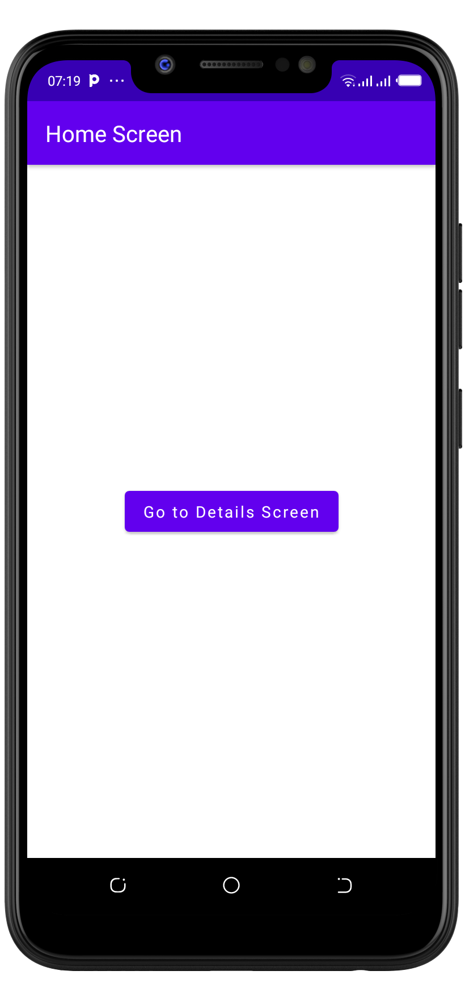
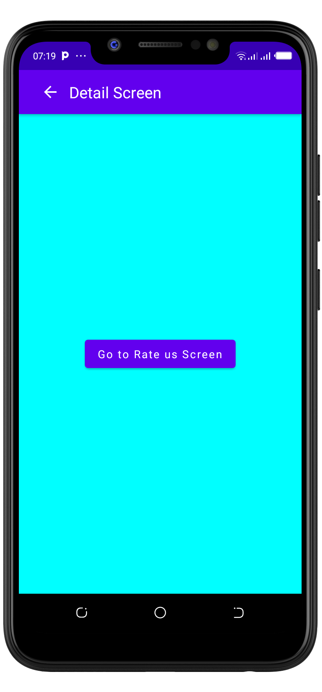
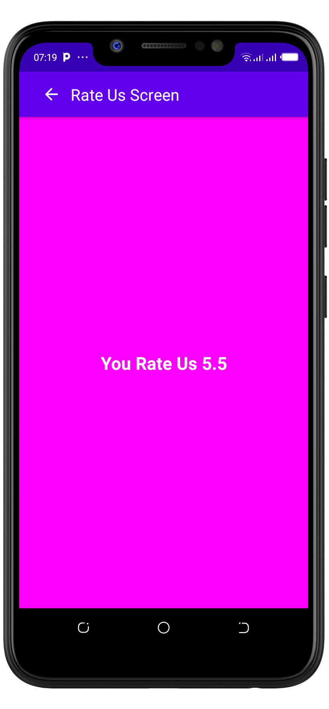

# ComposeNavigation-Assignment

### Goal
- Be able to navigate between screens
- Be able to pass arguments between screens

## Instructions
1. Fork this repository and clone it on your machine
2. Open the project on your Android Studio
2. After it finish setting up
3. Add the compose navigation dependency
4. Create three screens: 
    - HomeScreen
    - DetailsScreen
    - RatingScreen
5. Add a button at the center of the home screen written "Go to Details Screen" which when clicked, the user is navigated to Details Screen
6. Add a button at the center of details screen written "Rate us" which when clicked, it navigates the user to rating screen and you navigate to screen with some rating i.e 4.5. Once a user is taken to the rating screen, display the rating at the center of the screen.
7. Also make sure details and rating screen have a TopAppBar, that has a navigation icon that when clicked, it navigates the user to the previous screen

## Final Product Screen Navigation ScreenShots    

  
     &nbsp; &nbsp;
  
     &nbsp; &nbsp;
  
 

